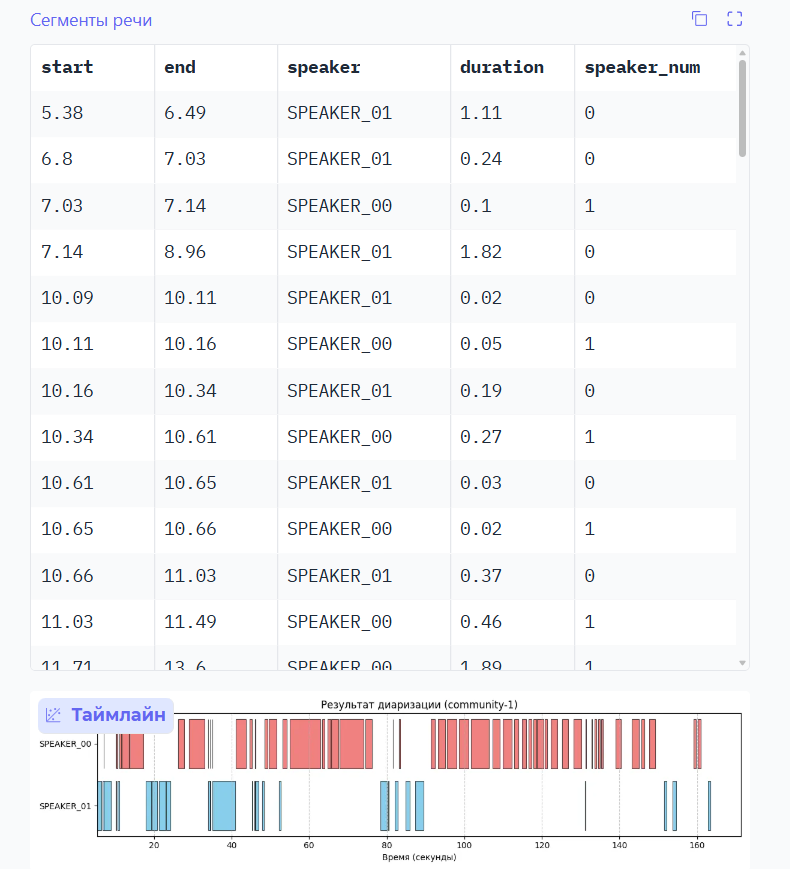

## Запуск

Для запуска необходимо установить FFmpeg.

```bash
    # Установить зависимости через uv
    uv sync
    
    # Запустить код
    python src/main.py
```

Приложение будет доступно по `http://localhost:7860`.

## Скриншоты


